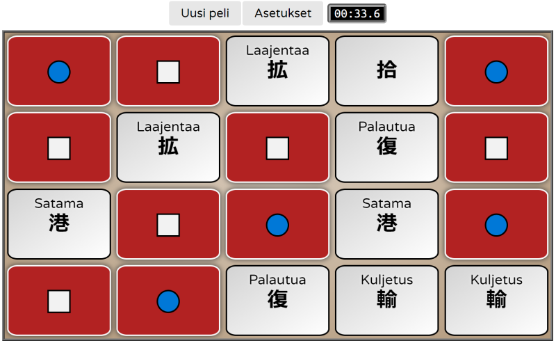

# Kanji Muistipeli

[](https://iminashi.github.io/kanji-muistipeli-fable/)

[Play Online](https://iminashi.github.io/kanji-muistipeli-fable/)

A matching game in Finnish with kanji characters.

This an F#/Fable/Elmish rewrite of [a game](https://github.com/iminashi/kanji-muistipeli) that I originally created with JavaScript/jQuery.

## Building and Running

Requirements:
- .NET 5 SDK
- Node.js

```
# Install Fable
dotnet tool restore

# Install JS dependencies
npm install

# Compile & start webpack dev server
npm start
```

## Libraries Used

- Fable
- Fable.Elmish.React
- Fable.SimpleHttp
- Feliz
- Thoth.Json
